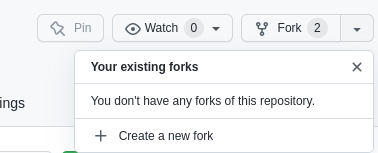
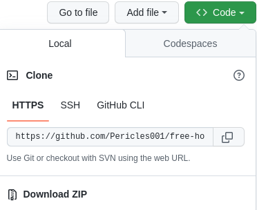
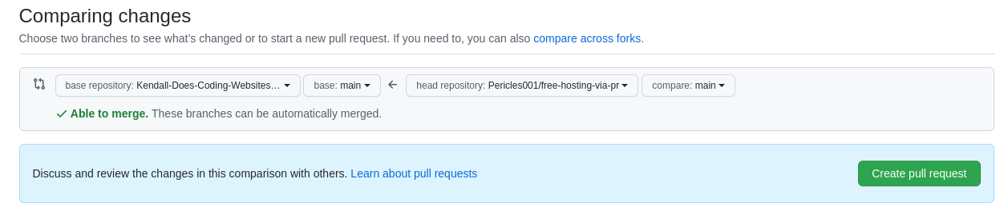

# free-hosting-via-pr

The repository stores a free hosting generator

## Description

free hosting via pr aims to grant user with a free hosting on Netlify ...

## Technologies

Technologies involved in this project are:
* [html](https://developer.mozilla.org/fr/docs/Web/HTML)
* [yaml](https://yaml.org/)
* [markdown](https://www.markdownguide.org/basic-syntax/)

## Usage

In order to test or use the project you should the following steps:

* Fork the repository

* Clone the forked repository

* Open the repository folder

    

    cd free-hosting-via-pr
  
* Make a new branch (with or without a checkout but example will use checkout)

    git checkout -b <new branch name>

* Customize your branch

      ...
  
* Send a pull request

    The outcome will be your free hosting

  
*  Netlify will post a deploy link as a comment in your PR thread.

## Deploy Status

## Acnowledgements

...
